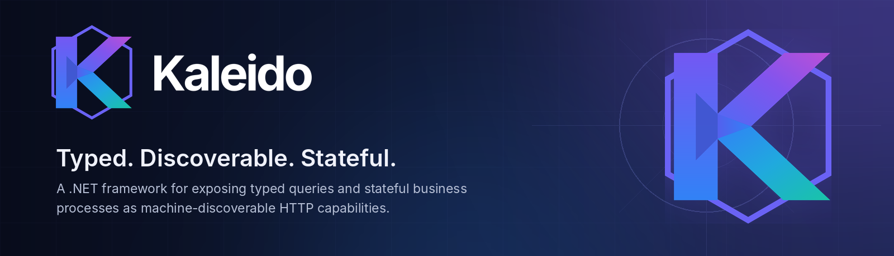

<p align="center">
  
</p>

<p align="center">
  <strong>Expose typed queries and stateful business processes as machine-discoverable HTTP capabilities.</strong>
</p>

<p align="center">
  
  
  
  
</p>

> [!IMPORTANT]
> Kaleido is under active pre-1.0 development. APIs and package boundaries may change while the public contract is refined.

## What is Kaleido?

Kaleido is a .NET framework for publishing business capabilities through consistent, typed, discoverable contracts.

It provides two complementary models:

| Model | Purpose | Examples |
|---|---|---|
| **Queryable** | Expose business information with search, filtering, sorting, paging, validation, and metadata. | Products, members, orders, reference data |
| **Process** | Expose stateful business actions with validation, dependencies, availability rules, and next-step guidance. | Start intake, submit order, approve request |

Kaleido publishes metadata describing those capabilities—including their inputs, outputs, constraints, relationships, and URLs—so applications, integrations, developer tools, and AI-assisted clients can understand what is available without reverse-engineering implementation details.

## Why Kaleido?

- **Discoverable by default** — registries describe available queries, process steps, fields, constraints, and routes.
- **Strongly typed** — business contracts remain ordinary .NET types with familiar validation attributes.
- **Stateful when needed** — Process tracks long-running, multi-step work through an explicit process identifier.
- **Transport-aware, not transport-bound** — the core runtime is separated from HTTP, clients, persistence, and observability providers.
- **Built for consumers** — the framework standardizes common behavior so clients do not need custom integration rules for every capability.

## Quick start

Register Kaleido and the HTTP transport in an ASP.NET Core application:

```csharp
var builder = WebApplication.CreateBuilder(args);

builder.Services
    .AddKaleido(builder.Configuration, options =>
    {
        options.ServiceName = "orders";
        options.DisplayName = "Orders";
        options.Assemblies = new[]
        {
            typeof(Program).Assembly
        };
    })
    .AddHttp();

var app = builder.Build();

app.MapKaleidoHttp();

app.Run();
```

Kaleido discovers annotated Queryable contexts, views, Process steps, and handlers from the configured assemblies, validates their registrations at startup, and publishes their HTTP surfaces and metadata.

For durable Process state, add the SQLite provider:

```csharp
builder.Services
    .AddKaleido(builder.Configuration, options =>
    {
        options.ServiceName = "orders";
        options.Assemblies = new[] { typeof(Program).Assembly };
    })
    .AddHttp()
    .UseSqliteContextStore("Data Source=kaleido-process.db");
```

## The capability model

### Queryable

Queryable answers:

> **What information does the business know?**

A context describes discoverable data. Views describe supported projections and parameters. Metadata communicates searchable, filterable, and sortable fields, paging limits, data types, and validation constraints.

### Process

Process answers:

> **What can the business do?**

A step represents a business action. Attributes describe dependencies, availability, and repeatability; handlers implement behavior; execution responses guide the consumer toward the next valid step.

### Discovery

Kaleido exposes lightweight catalogs, detailed registries, per-capability metadata, and an optional aggregated registry for multi-service environments. Consumers can use the advertised URLs instead of reconstructing route conventions.

## Packages

| Package | Purpose |
|---|---|
| [`Kaleido`](src/Kaleido) | Core Process and Queryable runtime |
| [`Kaleido.Http`](src/Kaleido.Http) | ASP.NET Core middleware and endpoint publication |
| [`Kaleido.Http.Abstractions`](src/Kaleido.Http.Abstractions) | Shared HTTP contracts |
| [`Kaleido.Http.Client`](src/Kaleido.Http.Client) | Typed clients for remote Kaleido services |
| [`Kaleido.Provider.SQLite`](src/Kaleido.Provider.SQLite) | SQLite-backed Process state |
| [`Kaleido.Observability.OpenTelemetry`](src/Kaleido.Observability.OpenTelemetry) | OpenTelemetry tracing, metrics, logs, and OTLP export |

## Documentation

- [Architecture](ARCHITECTURE.md)
- [Core runtime](src/Kaleido/README.md)
- [HTTP transport](src/Kaleido.Http/README.md)
- [HTTP clients](src/Kaleido.Http.Client/README.md)
- [SQLite provider](src/Kaleido.Provider.SQLite/README.md)
- [OpenTelemetry provider](src/Kaleido.Observability.OpenTelemetry/README.md)
- [Prior authorization sample](samples/PriorAuth)
- [E-commerce sample](samples/ECommerce)

## Project status

Kaleido is being prepared for its first public release. The current focus is simplifying the public API, strengthening production guarantees, validating package composition, and aligning documentation with the implementation.

Use preview releases for evaluation and experimentation until a stable compatibility policy is published.

## Contributing

Issues, design feedback, and focused pull requests are welcome. Start with [AGENTS.md](AGENTS.md) and [ARCHITECTURE.md](ARCHITECTURE.md) before making structural changes.

## License

Kaleido is available under the MIT License.
